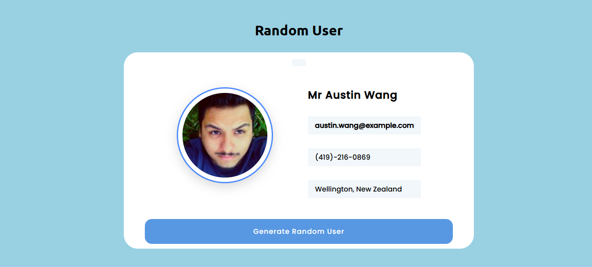

# Random User API Project

A simple web application that generates random user profiles using the Random User API.

## 🚀 Features

* Generate random users dynamically
* Display user profile image
* Show user's full name
* Show email address
* Show phone number
* Show user location
* Loading state while fetching data
* Error handling for failed API requests
* LocalStorage support to save the last generated user
* Previously generated user remains visible after page refresh
* Generate a new random user with one click

## 🛠️ Technologies Used

* HTML5
* CSS3
* JavaScript (ES6+)
* Fetch API
* Async/Await
* LocalStorage
* Random User API

## 📂 Project Structure

```text
Random-User-API-Project/
│
├── index.html
│
├── style/
│   └── style.css
│
├── script/
│   └── js.js
│
└── preview/
    └── preview1.png
```

## ⚙️ How It Works

The application fetches random user data from the Random User API.

```text
https://randomuser.me/api/
```

The API response provides user information such as:

* Profile picture
* Name
* Email
* Phone number
* City
* Country

JavaScript extracts the required information and displays it on the webpage.

The generated user data is also stored in LocalStorage, so the same user remains visible even after refreshing the page.

## 🔄 Application Flow

1. Page loads
2. Application checks LocalStorage
3. If a saved user exists, it displays that user
4. If no saved user exists, the application fetches a new user from the API
5. User clicks the "Generate Random User" button
6. A new random user is fetched
7. User information is displayed
8. New user data is saved in LocalStorage

## 🖼️ Preview



## 📚 Concepts Practiced

This project helped me practice:

* Fetch API
* Async/Await
* Try/Catch error handling
* DOM Manipulation
* ES6 Arrow Functions
* Working with API responses
* Object creation
* LocalStorage
* JSON.stringify()
* JSON.parse()
* Event Listeners

## ▶️ How to Run the Project

1. Clone the repository

```bash
git clone https://github.com/harishdubeyCS/Random-User-API-Project.git
```

2. Open the project folder.

3. Open `index.html` in your browser.

## 🌐 API Used

Random User Generator API

https://randomuser.me/

## 👨‍💻 Author

**Harish Dubey**

GitHub: https://github.com/harishdubeyCS

---

⭐ If you like this project, feel free to star the repository.
